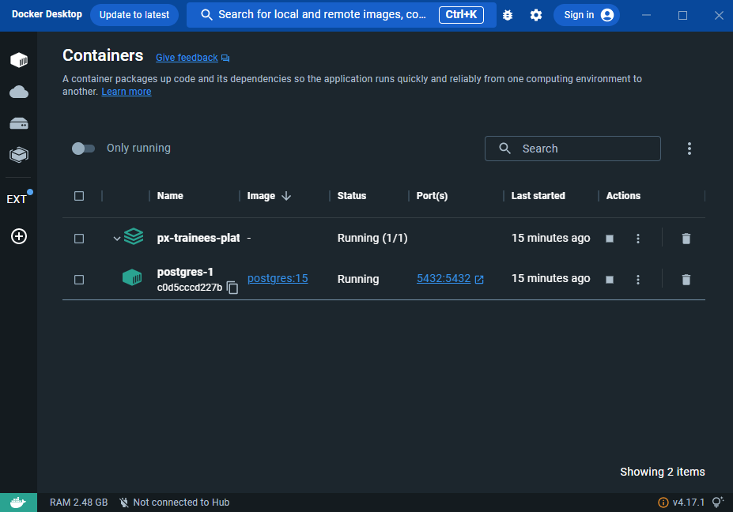
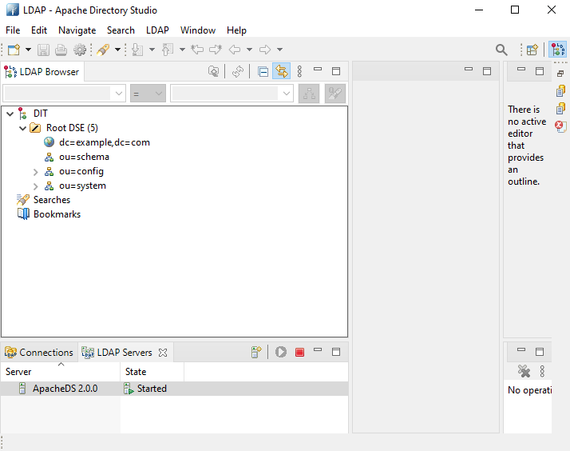

# Welcome

This is the backend section of my end of studies project, wich is a trainee recruitement platform that allows candidates to apply for internships provided by the company "proxym" and allow the hiring team to manage the applications

# Run the server

1. Install dependencies

   `yarn`

2. Modify the .env file to your needs

3. Run the docker image postgresql-1

4. Open Apache Directory Studio and run the LDAP server

5. Run the server

   `yarn start:dev`

6. Open swagger to see the different Endpoints

   `http://localhost:3000/docs/#/`

